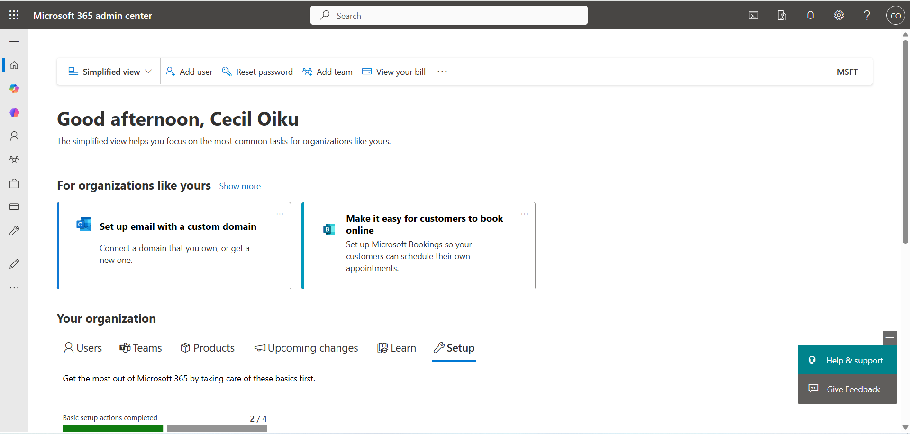
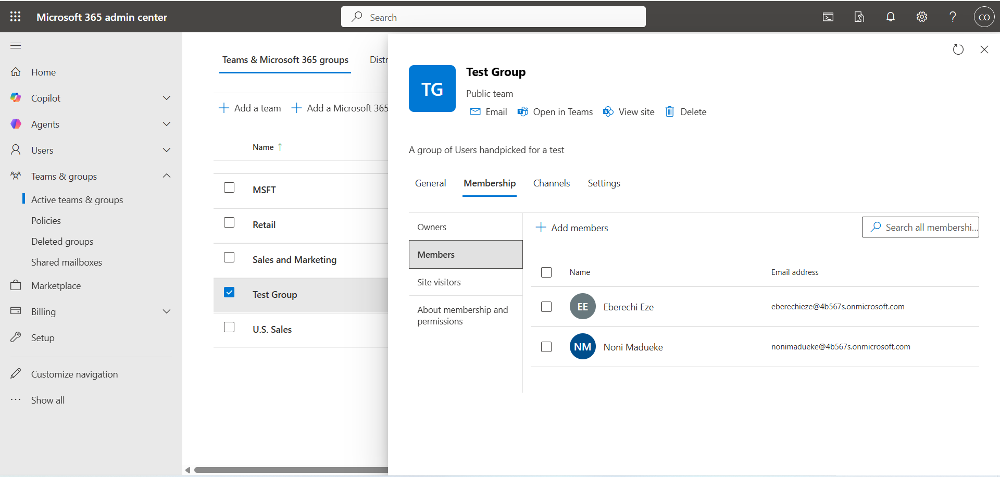

# Lab 01 — Tenant Setup + Audit Foundation

This lab simulates identity and administrative activity to validate audit visibility for security monitoring.

## Objective

Stand up an M365 lab tenant, enable auditing, and generate auditable activity.

## Environment

- Tenant: your-tenant-name.onmicrosoft.com
- Tools: Microsoft 365 Admin Center, Microsoft Purview (Audit)

## Actions Completed

- Created test users: Eberechi Eze, Noni Madueke
- Created test group: Test Group
- Generated administrative activity:
  - Multiple authentication events (User sign-ins)
  - Privileged changes (Group membership modifications)

## Evidence (Screenshots)

### 1. Admin Center Overview (Tenant Proof)

### 2. Test Group Membership (Users Visible)

### 3. Audit Log Event (Member Added)
