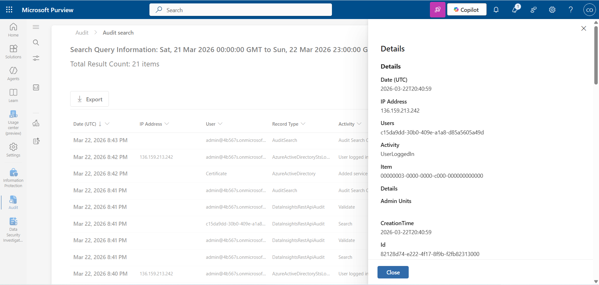
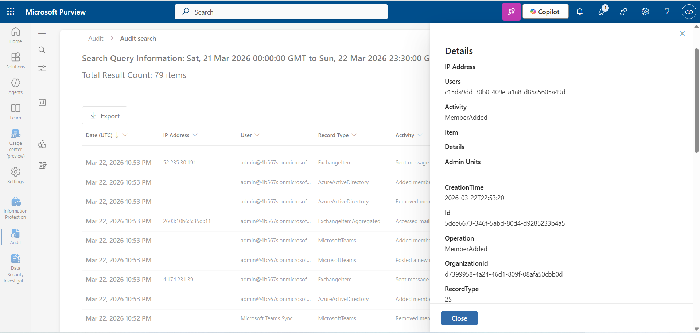
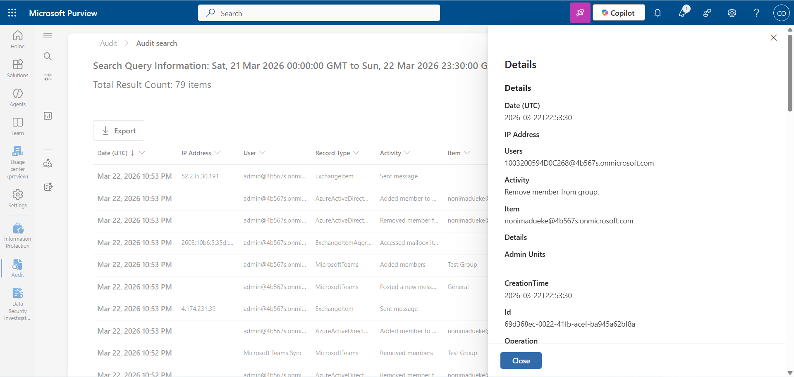

# Lab 02 — Audit Log Investigation

## Objective

Analyze Microsoft Purview audit logs to identify and interpret security-relevant activity.

## Environment

* Microsoft Purview Audit Logs
* Time Range: Last 24 hours

## Investigation Summary

During log review, multiple activities were observed including user sign-ins and group membership changes.

A group membership removal event was selected for deeper analysis due to its impact on access control and permissions.

## Key Event Evidence

### 1. User Sign-In Event

### 2. Group Membership Added

### 3. Group Membership Removed

## Findings

- User sign-in activity observed from admin account
- Group membership added event recorded
- Group membership removal event analyzed in detail

## Event Timeline

| Time (UTC) | Event |
|------------|------|
| 20:40 | User login (admin account) |
| 22:53 | Member added to group |
| 22:53 | Member removed from group |

## Key Event Analyzed

* **Activity:** Remove member from group
* **User (Actor):** [admin@yourtenant.onmicrosoft.com](mailto:admin@yourtenant.onmicrosoft.com)
* **Target User:** [nonimadueke@yourtenant.onmicrosoft.com](mailto:nonimadueke@yourtenant.onmicrosoft.com)
* **Workload:** Azure Active Directory
* **Time:** 2026-03-22T22:53:30

## Analysis

The audit logs show that an administrative account removed a user from a group.
This indicates a change in access control and permissions within the environment.

This demonstrates:

* Audit logging is enabled and functioning
* Administrative actions are traceable
* Identity and access changes are captured in logs

## Broader Observations

Additional activity observed in the logs:

* Multiple successful user sign-ins
* Group membership additions
* Group membership removals

## What I Would Alert On

- Alert on rapid group membership changes within short timeframes
- Alert on privilege changes performed by administrative accounts
- Correlate sign-in activity with subsequent administrative actions

## Conclusion

The environment is successfully capturing audit data for both authentication and administrative actions.
These logs provide sufficient visibility for detecting and investigating potential security events.

No suspicious activity was identified in this instance.
