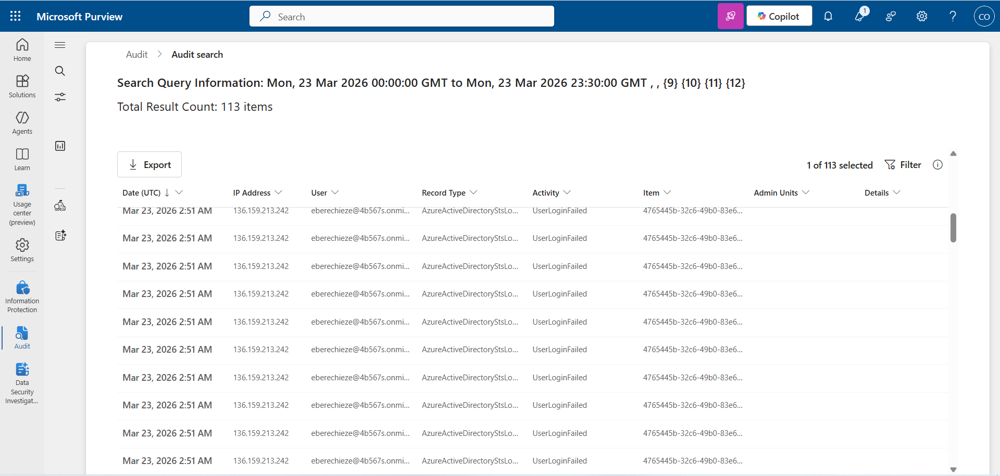
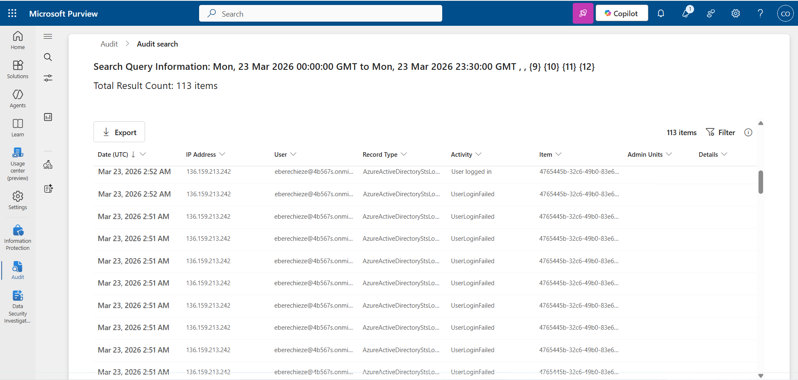
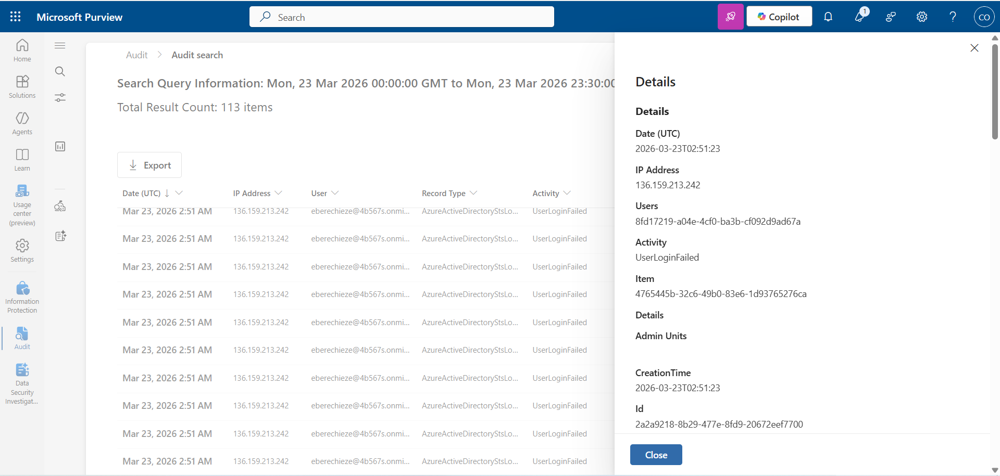

## Identity Sign-In Investigation Report

---

## Executive Summary

A sequence of multiple failed login attempts followed by a successful authentication was observed for a user account within a short timeframe. The activity originated from the same IP address and is consistent with a potential brute-force or password guessing attack. Although this activity was generated in a controlled lab environment, similar behavior in a production environment would be considered suspicious and require immediate investigation.

---

## Timeline (UTC)

| Time (UTC) | Event                                                    |
| ---------- | -------------------------------------------------------- |
| 02:51      | Multiple failed login attempts detected for user account |
| 02:52      | Successful login from the same IP address                |

---

## Evidence

### 1. Multiple Failed Login Attempts

### 2. Successful Login After Failures

### 3. Expanded Event Details

---

## Findings

* Multiple consecutive failed authentication attempts were observed for the same user account
* A successful login occurred immediately after the failed attempts
* All events originated from the same IP address (136.159.213.242)
* The activity occurred within a very short timeframe (approximately 1 minute)

---

## Analysis

The observed pattern of repeated failed login attempts followed by a successful authentication is indicative of a brute-force or password guessing attack. The short time interval between attempts and the eventual success suggests that the correct credentials were eventually obtained.

Additionally, the fact that both failed and successful login attempts originated from the same IP address indicates that the same entity was responsible for both the failed attempts and the successful authentication. This strengthens the likelihood of a successful compromise rather than normal user behavior.

While this activity was intentionally generated in a lab environment, similar patterns in a real-world scenario would be considered high-risk and warrant immediate response.

---

## Confidence

**Medium**

The activity strongly matches known attack patterns (failed-to-success login sequence), but lacks additional context such as geolocation anomalies, device fingerprinting, or threat intelligence indicators to confirm malicious intent with high certainty.

---

## Containment Actions

* Force password reset for the affected account
* Enable Multi-Factor Authentication (MFA) to prevent unauthorized access
* Review recent account activity for any unauthorized actions
* Monitor for repeated login attempts or suspicious behavior
* Block or investigate the originating IP address if deemed malicious

---

## Detection Ideas

* Create alerts for multiple failed login attempts followed by a successful login within a short time window
* Detect excessive failed authentication attempts per user within a defined timeframe
* Correlate login activity with IP address reputation or geolocation anomalies
* Alert on successful logins occurring immediately after repeated failures

---
