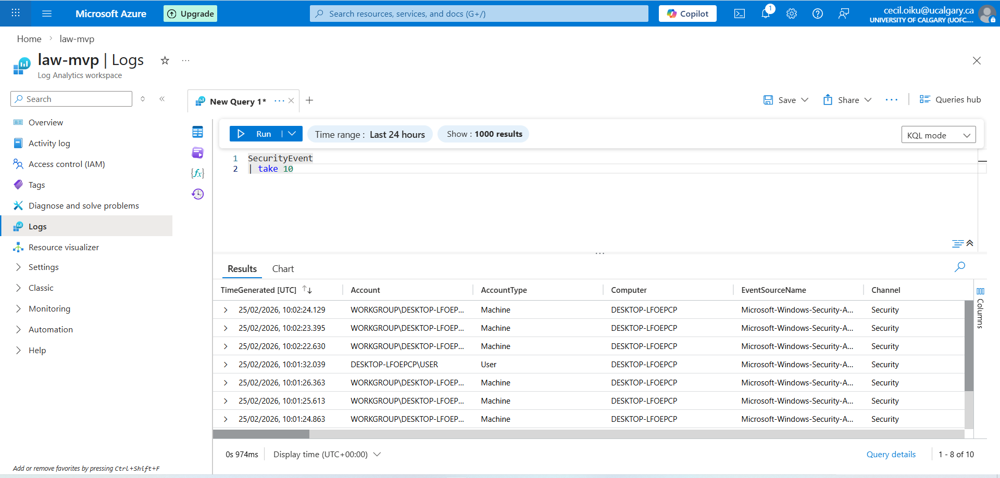
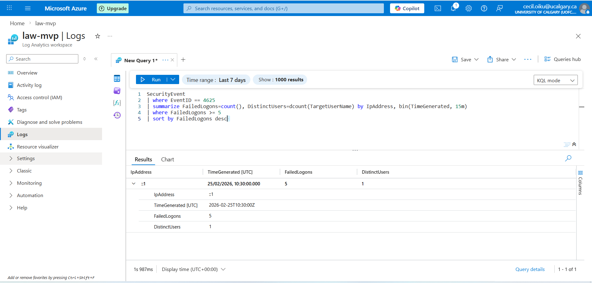
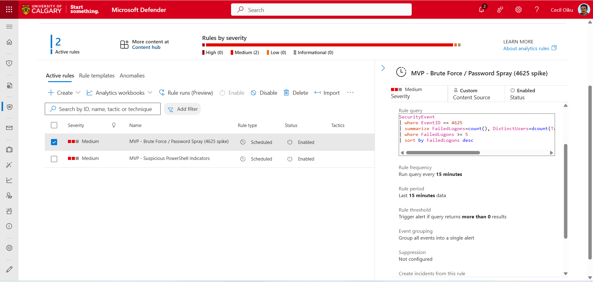
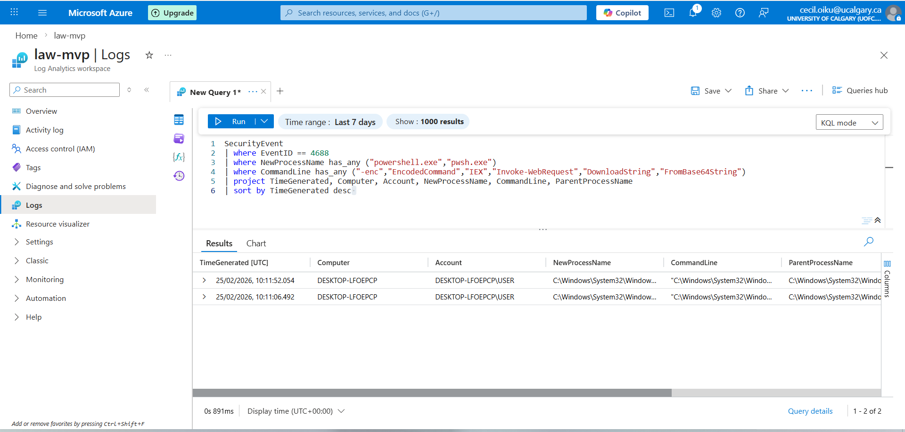
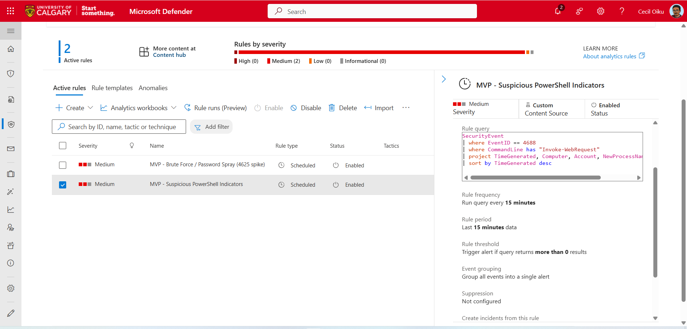

# Microsoft Sentinel — Detection Engineering Lab

## Objective

Design and implement detection rules in Microsoft Sentinel using KQL to identify suspicious authentication and process activity.

---

## Environment

- SIEM: Microsoft Sentinel
- Workspace: law-mvp
- Data Source: Windows Security Events (via AMA)
- Table: SecurityEvent
- Endpoint: Azure Arc–connected Windows machine

---

## Detection 1 — Brute Force / Password Spray (Event ID 4625)

### Logic
Detect multiple failed login attempts from a single IP within a short time window.

### KQL
(see kql/bruteforce-4625.kql)

### Why it matters
Repeated failed logins may indicate:
- Brute-force attack
- Password spraying

### Limitations
- May generate false positives (user mistyping password)
- Requires proper log ingestion

---

## Detection 2 — Suspicious PowerShell Execution (Event ID 4688)

### Logic
Detect PowerShell processes with suspicious command-line patterns.

### KQL
(see kql/powershell-4688.kql)

### Why it matters
PowerShell is commonly used for:
- Malware execution
- Living-off-the-land attacks

### Limitations
- May flag legitimate admin scripts
- Requires command-line logging enabled

---

## Evidence

### Log Ingestion

### Brute Force Detection Results

### Brute Force Rule Enabled

### PowerShell Detection Results

### PowerShell Rule Enabled

---

## Skills Demonstrated

- SIEM deployment (Microsoft Sentinel)
- Log ingestion (Azure Arc + AMA)
- KQL query development
- Detection engineering
- Security event analysis