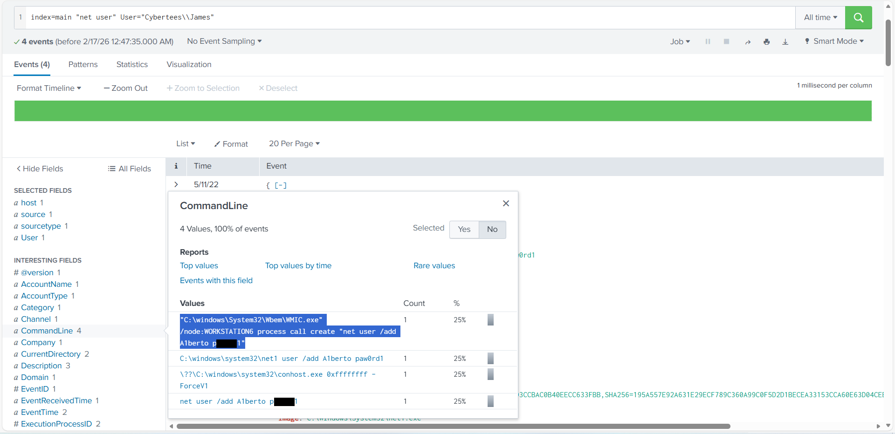

# Project 06 — Backdoor User Creation + Encoded PowerShell C2 (Splunk)

## Overview
Anomalous behavior suggested an attacker established persistence and executed suspicious PowerShell. Using Windows Security / Sysmon logs and PowerShell telemetry in Splunk, I identified creation of a new local user, correlated registry artifacts, confirmed remote execution used to add the account, and decoded an encoded PowerShell script to recover the C2 URL.

> Note: Lab/synthetic dataset. Screenshots may be lightly sanitized/redacted.

## Dataset
Data sources ingested into Splunk:
- `wineventlog` (Windows Security / Event logs)
- PowerShell Operational logs (PowerShell execution telemetry)
- Sysmon/Operational events (registry + host telemetry observed in the dataset)

## Investigation Steps and Findings

### 1) Identify creation of a suspicious user account
The dataset contained **12,256** events. I searched for Windows Security **EventID 4720** (user account created) and found a newly created account:

- New account: `Alberto`

---

### 2) Correlate registry artifacts for the new account
Sysmon/Operational registry events showed activity under the SAM user path:

`HKLM\SAM\SAM\Domains\Account\Users\Names\Alberto`

This supports that the new account was present in the local account database.

---

### 3) Determine how the account was created (remote execution evidence)
Command-line telemetry shows the account was created via **WMIC remote process execution** that launched a `net user /add ...` command.  
(Password value is redacted in screenshots for safety.)

---

### 4) Validate logon activity (not observed)
I searched for common logon event IDs (e.g., 4624/4625) associated with the new account and did not observe clear evidence of an interactive logon for `Alberto` within the available logs.  
(images/08-no-logon-events.png)

---

### 5) Investigate suspicious PowerShell execution and decode payload
PowerShell telemetry indicated the suspicious activity concentrated on host:

- `James.browne`

PowerShell **EventID 4103** showed an encoded command (`powershell.exe -enc <base64>`), consistent with obfuscated execution.

I decoded the Base64 content in CyberChef. The decoded script included:
- AMSI bypass indicators (references to `AmsiUtils` / `amsiInitFailed`)
- WebClient usage for outbound web requests
- An embedded Base64 string that resolves to an internal C2 base URL

The embedded Base64 string decodes to:

- `http://10.10.10.5`

The script’s outbound request targeted:
- `http://10.10.10.5/news.php` (defanged in IOC list)

---

## Key Takeaways
- A new local account (`Alberto`) was created (EventID 4720) and correlated with SAM registry artifacts.
- Creation was performed via remote execution (WMIC → net user add).
- Encoded PowerShell execution (EventID 4103) was decoded to reveal AMSI bypass indicators and a C2-style web request to an internal host.

## Detection Ideas
- Alert on Security **4720** (new local users), especially when paired with remote execution tooling.
- Hunt for **WMIC remote process** usage creating accounts (`process call create` + `net user /add`).
- Alert on PowerShell `-enc` usage and PowerShell Operational **4103** events.
- Flag AMSI bypass indicators (references to `AmsiUtils` / `amsiInitFailed`).
- Monitor web requests to unusual internal servers and suspicious endpoints (e.g., `/news.php`).

## Indicators of Compromise
See: [iocs/iocs.md](iocs/iocs.md)