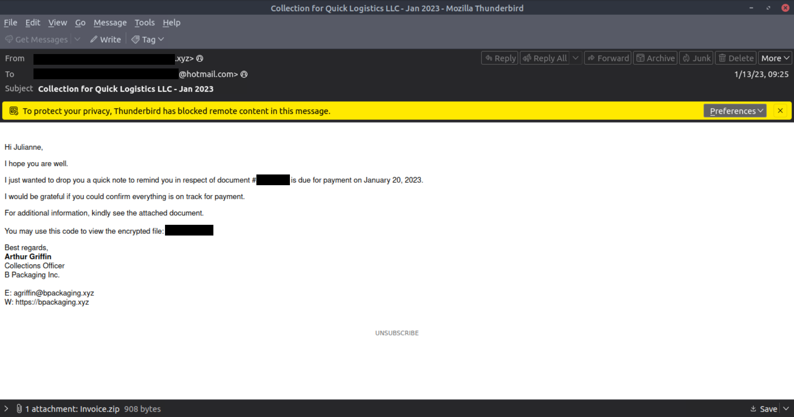
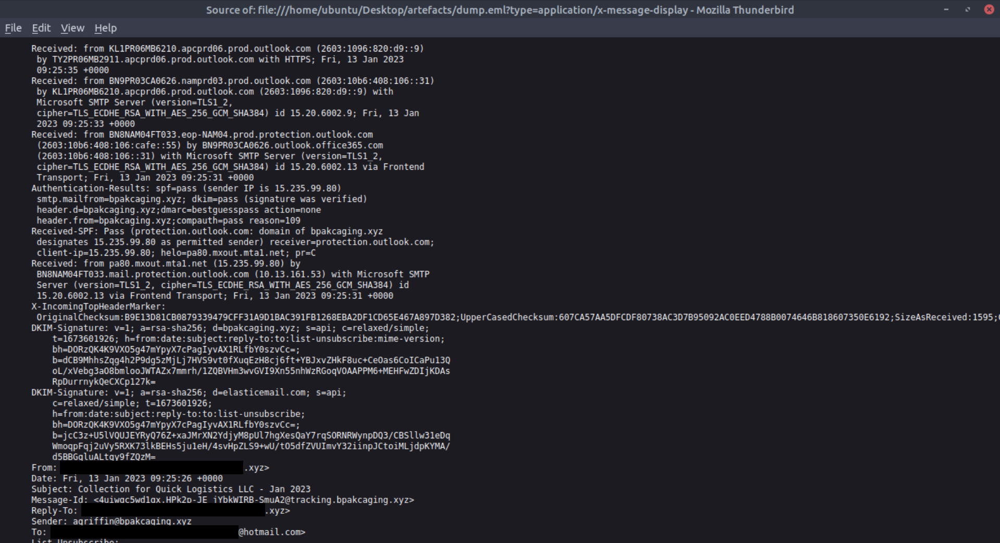
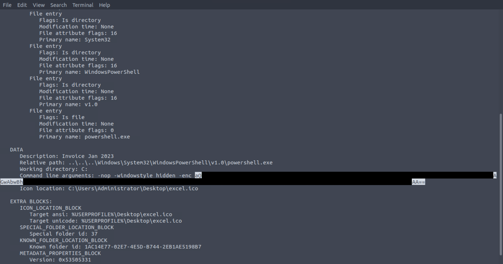
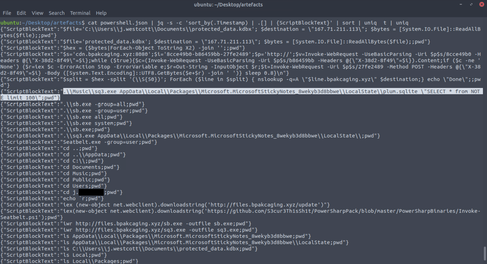
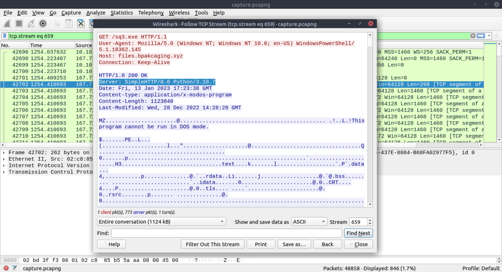
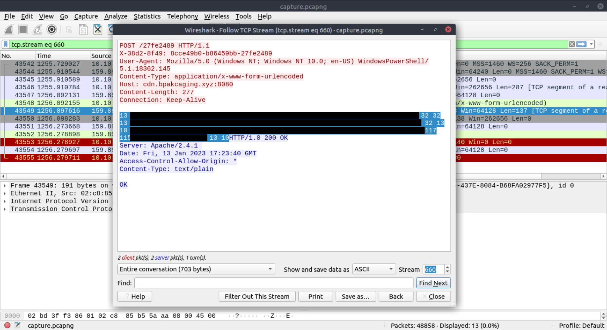

# Project 1 — Phishing to PowerShell Execution, HTTP Tool Retrieval, and DNS Exfiltration (Investigation)

## Overview
This investigation analyzes a phishing email that delivered a malicious attachment leading to hidden PowerShell execution, retrieval of additional tooling over HTTP, command-and-control (C2) communication, and DNS-based data exfiltration behavior. Findings are based on email artefacts, PowerShell logs, and packet capture evidence.

## Dataset
- `dump.eml` — Phishing email message (headers + body + attachment metadata)
- `powershell.json` — PowerShell script block logging (exported)
- `capture.pcapng` — Network packet capture (HTTP/DNS)

## Tools
Thunderbird, `lnkparse`, `jq`, Wireshark, `tshark`

---

## 1) Initial Access: Email Analysis
The email used a payment/collection theme and delivered a compressed attachment. Message headers were reviewed to identify infrastructure indicators (e.g., authentication and relay artefacts).

---

## 2) Execution Chain: Shortcut (LNK) → PowerShell
Attachment triage identified a Windows shortcut (`.lnk`) designed to launch PowerShell with a hidden window and an encoded command line, consistent with obfuscation and “living off the land” execution.

---

## 3) Host Activity: PowerShell Script Block Evidence
PowerShell logs showed activity consistent with local collection and staging of data. Notably, activity referenced the Windows Sticky Notes database (`plum.sqlite`), indicating potential user-data targeting.

---

## 4) Network Activity: Payload Hosting and C2
PCAP analysis showed HTTP downloads from attacker-controlled infrastructure and POST-based communications consistent with C2 output/response exchange.

---

## 5) Exfiltration: DNS Patterns
DNS traffic contained repeated queries to attacker-controlled domains, consistent with DNS-based exfiltration patterns (high-volume, encoded-looking subdomains). Sensitive reconstructed content is not included in this public report.

---

## Indicators of Compromise (IOCs)
**Domains**
- `files.bpakcaging.xyz`
- `cdn.bpakcaging.xyz`

**IP**
- `167.71.211.113` *(observed in traffic/log context)*

**Files**
- `Invoice_20230103.lnk`
- `sq3.exe`

## Notes on Sanitization
This report intentionally omits decoded secrets, credentials, and reconstructable payload material. Screenshots were cropped/redacted to preserve investigative value while preventing disclosure of sensitive data.