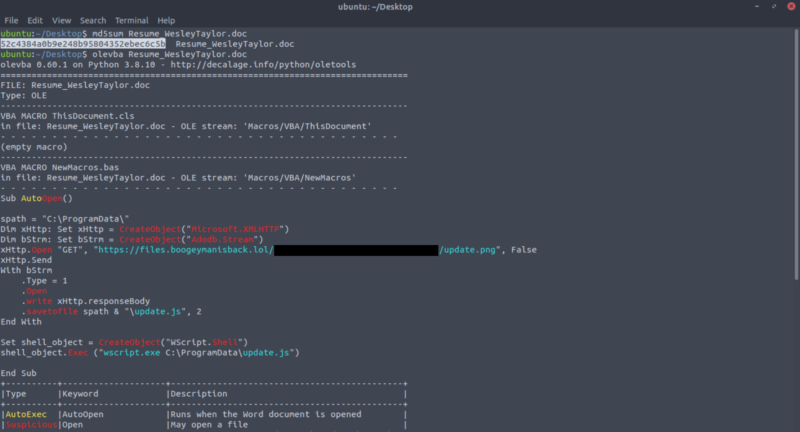
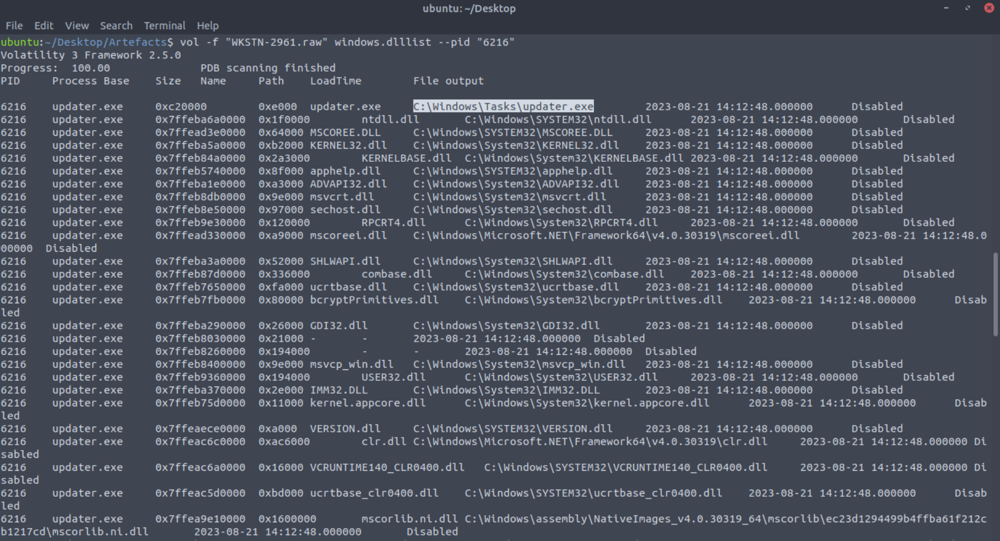
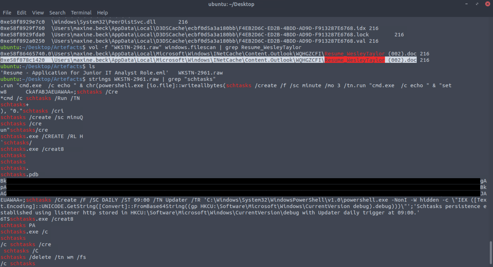
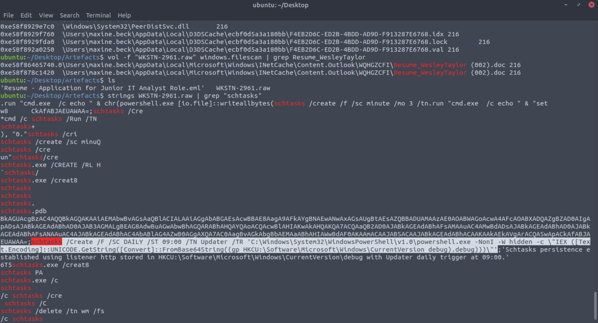

# Project 2 — Malicious Resume (Macro) to Memory Forensics (Process Chain, C2, Persistence)

## Overview
This investigation analyzes a phishing email delivering a malicious Microsoft Word document. Static macro analysis identified an AutoOpen-triggered download and script execution chain. Memory forensics (Volatility) was then used to validate execution, identify the dropped/loaded malware location, confirm C2 connectivity, and recover persistence indicators.

## Dataset
- `Resume: Application for Junior IT Analyst Role.eml` — phishing email artefact
- `WKSTN-2961.raw` — memory image for host-based investigation

## Tooling
- Static analysis: `olevba` (oletools)
- Memory forensics: Volatility 3
- Hashing: `md5sum` (and additional hashes where available)

---

## 1) Delivery: Phishing Email
The message used a job application theme and included a Word document attachment intended to appear legitimate.

---

## 2) Static Analysis: Macro Execution Chain
Macro inspection showed an AutoOpen entry point that performs:
- an HTTP(S) retrieval from attacker infrastructure
- creation of a secondary script on disk (JavaScript)
- execution via Windows Script Host (`wscript.exe`)

---

## 3) Memory Forensics: Process Tree (WINWORD → wscript → malware)
The memory image confirmed the expected execution flow:
- `WINWORD.EXE` spawned `wscript.exe`
- `wscript.exe` then led to the execution of a suspicious binary (`updater.exe`)

---

## 4) Malware Location: Loaded Binary Path
Module and file path evidence linked the suspicious process to a non-standard location:

- `C:\Windows\Tasks\updater.exe`

---

## 5) Command-and-Control (C2) Evidence
Network socket artefacts associated with `updater.exe` showed outbound connectivity consistent with C2 traffic:

- `128.199.95.189:8080`

---

## 6) Artefact Recovery: Attachment Location in Memory
A file scan identified the attachment artefact consistent with an Outlook cache location, supporting the original delivery path.

---

## 7) Persistence Indicator: Scheduled Task
String/artefact searching revealed evidence of scheduled-task persistence creation (task name and schedule observed).  
The full command line is intentionally redacted in this public report.

---

## Key Findings (Summary)
- Malicious Word document used a macro AutoOpen trigger to download a second-stage resource and execute script content via `wscript.exe`.
- Memory analysis confirmed the process chain from Office to Windows Script Host and into a suspicious `updater.exe` process.
- The malware binary resided in `C:\Windows\Tasks\updater.exe`, a non-standard location for legitimate software.
- The malware initiated outbound connectivity to `128.199.95.189:8080`.
- Persistence artefacts indicated scheduled-task creation to maintain access.

## Sanitization Note
This writeup intentionally omits reconstructable payloads, Base64 blobs, and full persistence command lines. Screenshots are cropped/redacted to preserve investigative value without enabling replication.