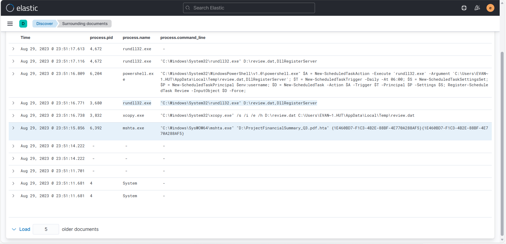
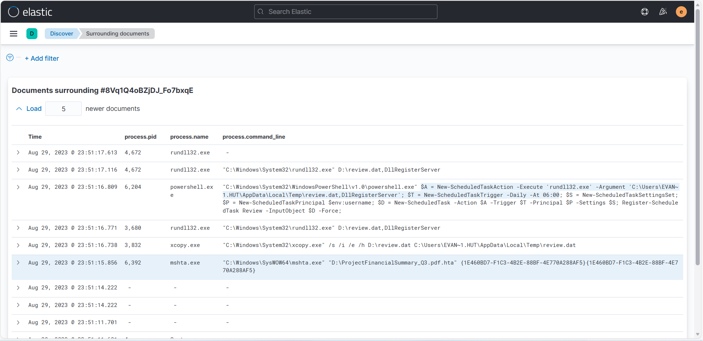
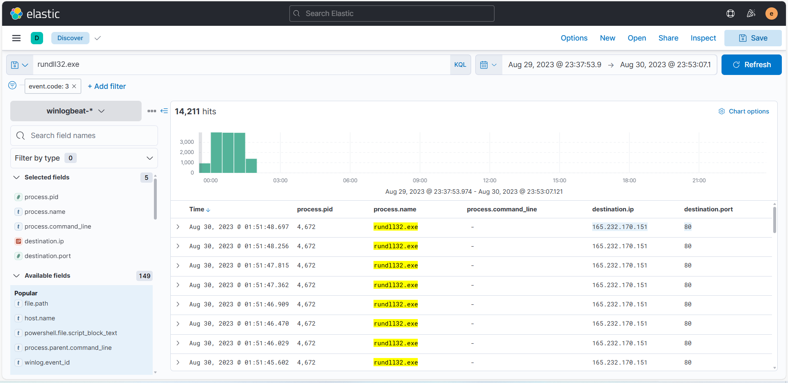
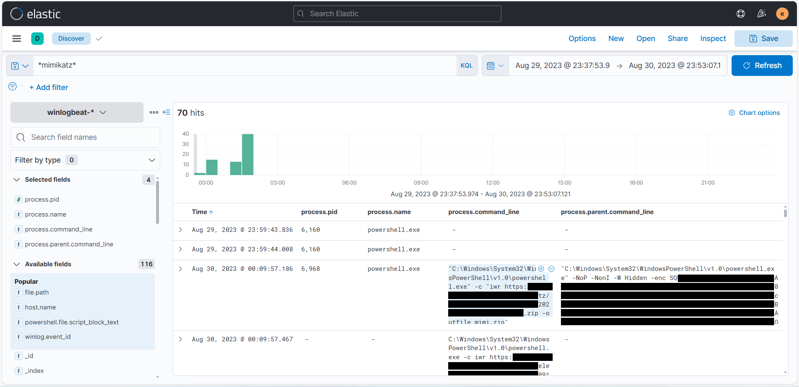
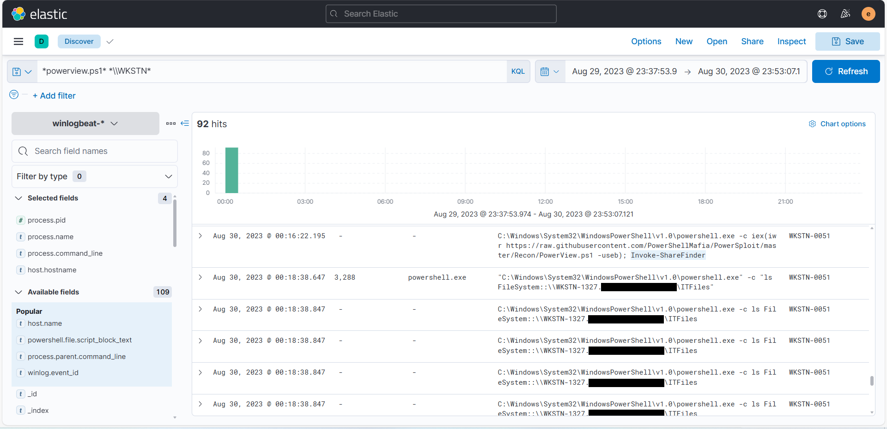
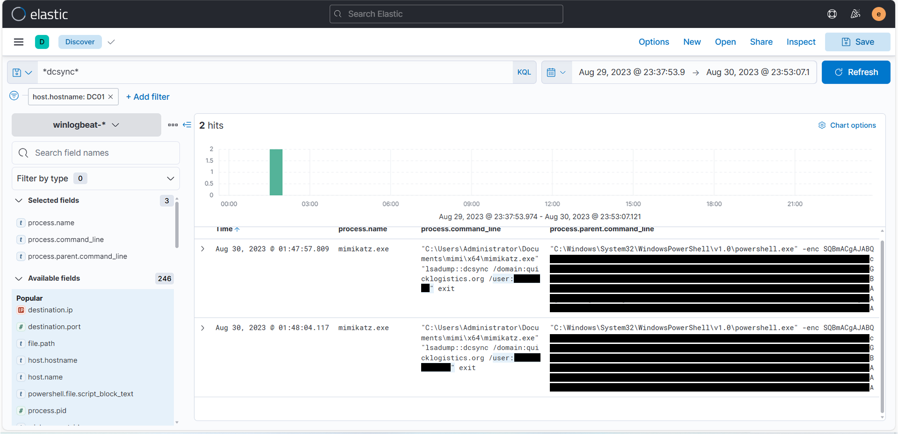
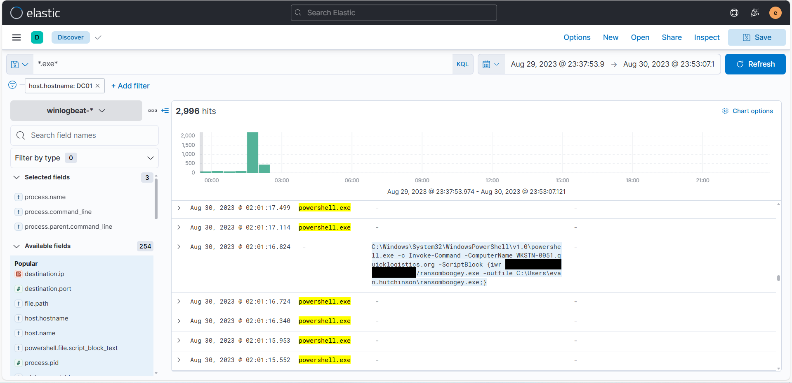

# Project 03 — Phishing → HTA Execution → Lateral Movement → DCSync Attempt (ELK)

## Summary
This investigation analyzes a multi-stage intrusion observed in endpoint telemetry indexed in ELK (Winlogbeat) between **Aug 29–30, 2023**. The activity begins with execution of an **HTML Application (.hta)** via **mshta.exe**, followed by file staging, **DLL side-loading via rundll32**, persistence creation, suspicious administration tooling, credential access behavior, lateral movement, and an attempted **DCSync** from the domain controller. The campaign concludes with an attempted ransomware download.

> Note: This is a lab/synthetic dataset. Screenshots published here are redacted to avoid exposing sensitive strings (passwords, hashes, encoded blobs).

---

## Data Sources
- Phishing email artifact (headers/body + attachment metadata)
- Payload artifacts: `ProjectFinancialSummary_Q3.pdf` (container/attachment) and embedded `ProjectFinancialSummary_Q3.pdf.hta`
- Endpoint telemetry indexed in ELK (Winlogbeat), Aug 29–30, 2023

---

## Investigation Approach (High Level)
1. Identify initial execution of the attachment payload (hunt for HTA / mshta).
2. Pivot to surrounding process events to reconstruct the execution chain.
3. Validate persistence artifacts (scheduled task creation).
4. Identify follow-on payload behaviors (rundll32, dropped/staged files).
5. Hunt for credential access and post-exploitation tooling.
6. Track movement to additional hosts and domain controller activity.
7. Confirm end-stage intent (ransomware download attempt).

---

## Key Findings (with Evidence)

### 1) Initial execution via mshta (HTA)
`mshta.exe` executed the embedded HTA payload (`ProjectFinancialSummary_Q3.pdf.hta`), indicating HTML Application-based execution.

---

### 2) Staging + execution chain (mshta → xcopy → rundll32)
Immediately following execution, the payload staged a secondary file (`review.dat`) and executed it via `rundll32.exe` (export: `DllRegisterServer`), consistent with DLL loader abuse.

---

### 3) Persistence via scheduled task
A scheduled task named `Review` was created to re-trigger the malicious loader on a daily schedule.

---

### 4) C2 / external connectivity from rundll32
Network telemetry (event.code: 3) shows `rundll32.exe` connecting to an external IP over HTTP (port 80), consistent with command-and-control / payload retrieval.

---

### 5) Privilege escalation signal (fodhelper usage)
Process telemetry shows `fodhelper.exe` activity in proximity to suspicious execution, which is commonly associated with UAC bypass techniques.

---

### 6) Credential access + post-exploitation tooling indicators
Hunting revealed indicators consistent with credential dumping and domain enumeration activity (tooling references observed in command-lines). Any sensitive strings (hashes/passwords/encoded blobs) are redacted in published screenshots.

---

### 7) Domain controller activity + DCSync attempt
Telemetry from the domain controller includes indicators consistent with a DCSync attempt.

---

### 8) Ransomware download attempt
Later activity includes an attempted download of a ransomware binary (`ransomboogey.exe`). The URL is defanged/redacted in screenshots.

---

## Timeline (Condensed)
- **T0:** HTA executed via `mshta.exe`
- **T0 + minutes:** `review.dat` staged and executed via `rundll32.exe`
- **T0 + minutes:** Scheduled task `Review` created (persistence)
- **Later:** Credential access tooling indicators observed
- **Later:** Lateral movement / remote execution indicators observed
- **Later:** Domain controller activity shows DCSync attempt indicators
- **End:** Ransomware download attempt observed

---

## Detection Ideas (Defensive)
- Alert on `mshta.exe` executing `.hta` from user-controlled locations or mounted/ISO volumes
- Alert on `rundll32.exe` loading unusual file types (e.g., `.dat`) and exports like `DllRegisterServer`
- Monitor scheduled task creation with suspicious binaries/arguments
- Flag PowerShell with encoded command-lines (`-enc`) originating from unusual parents
- Detect credential dumping strings/processes (e.g., “mimikatz”, “sekururlsa”, “dcsync”) in command-line telemetry
- Monitor domain controller for DCSync-like behavior (replication permissions usage anomalies)

---

## Indicators of Compromise
See: [iocs/iocs.md](iocs/iocs.md)

---

## Notes / Limitations
- This writeup focuses on what is observable in the ELK telemetry window.
- Some commands/strings are intentionally redacted to prevent leaking sensitive material in a public portfolio.