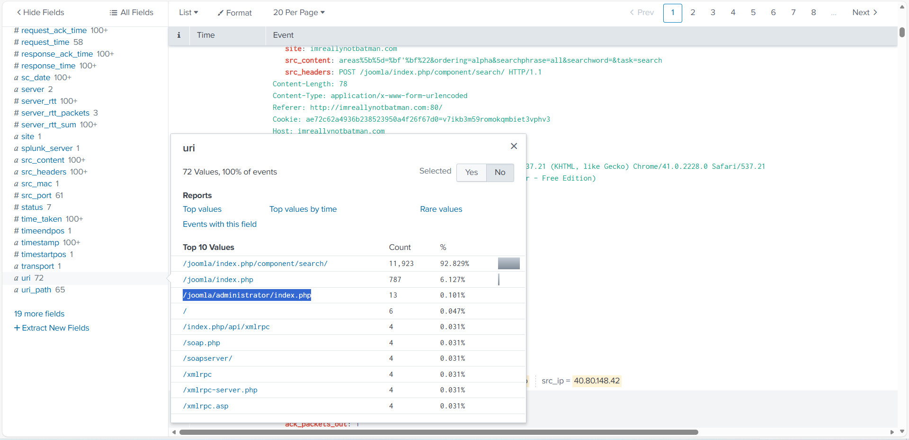
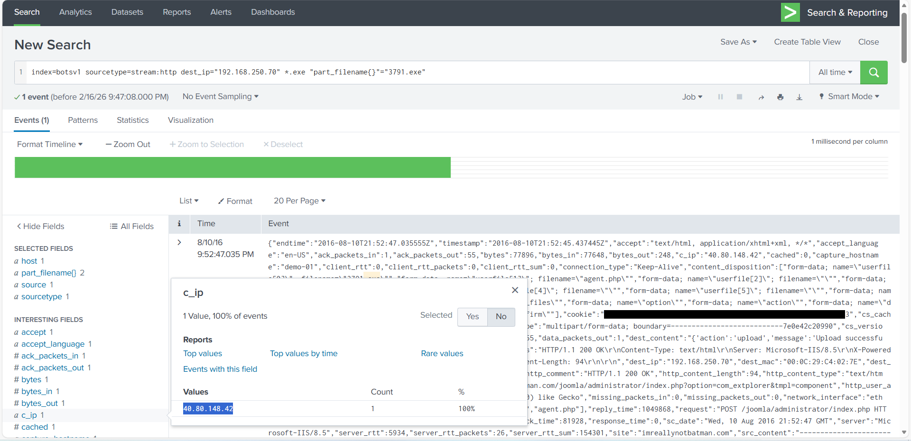
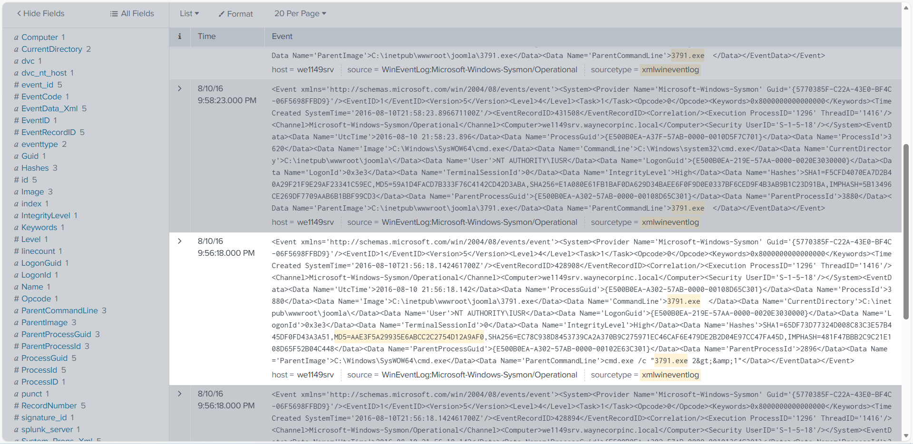
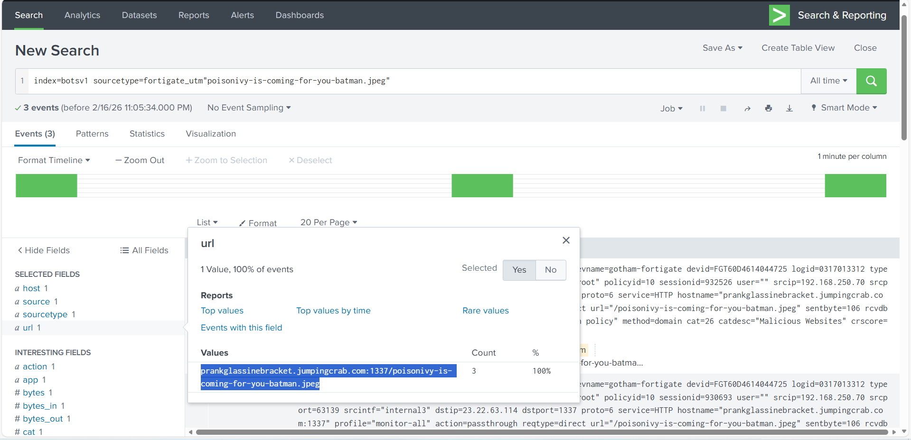

# Project 05 — Joomla Web Server Compromise & Defacement (Splunk)

## Overview
A public-facing web server was reported as hacked/defaced. Using Splunk (BOTS v1-style dataset), I investigated inbound HTTP traffic, IDS alerts, and host telemetry to identify attacker infrastructure, credential attacks against the Joomla admin portal, suspicious file upload/execution, and external domains associated with the defacement artifact.

> Note: Lab/synthetic dataset. Screenshots may be lightly sanitized/redacted.

## Dataset
Data sources ingested into Splunk:
- `stream:http`, `stream:dns`, `stream:icmp` (network telemetry)
- `suricata` (IDS alerts)
- `fortigate_utm` (firewall / web filtering)
- `iis` (web server logs)
- `XmlWinEventLog` / Sysmon + Windows Event logs (endpoint telemetry)
- `Nessus:scan` (vulnerability scan results)
- `winRegistry` (registry modification telemetry)

## Investigation Steps and Findings

### 1) Identify suspicious external IPs in HTTP telemetry
From `stream:http`, the `src_ip` field showed two primary external IPs communicating with the web server:
- `40.80.148.42` (17,483 events)
- `23.22.63.114` (1,235 events)

URI analysis showed repeated Joomla-related requests and probing behavior (e.g., `/windows/win.ini`), consistent with web reconnaissance.

---

### 2) Validate IDS alerts and attacker tooling
In Suricata, an alert signature indicated attempts associated with **CVE-2014-6271**, categorized as an attempted privilege gain / web server exploit attempt.

HTTP user-agent analysis also surfaced scanner fingerprints consistent with automated web scanning (e.g., Acunetix test strings).  
(Recommended: redact raw payload strings before publishing.)

---

### 3) Investigate Joomla admin portal traffic and brute-force behavior
Filtering POST traffic to the web server highlighted the same two source IPs, with one IP responsible for a concentrated set of POST activity.

URI review identified the Joomla admin login path:

A focused search on POSTs to the admin endpoint showed repeated login attempts with `username=admin` and many password guesses in rapid succession.  
(Recommended: blur/redact the entire `form_data` column.)

User-agent analysis strongly suggested automation:
- `Python-urllib/2.7` accounted for the overwhelming majority of these login attempts.

---

### 4) Identify suspicious file uploads and confirm execution
Searching for executable uploads in HTTP data surfaced two filenames:
- `3791.exe`
- `agent.php`

Additional context tied the upload activity to client IP `40.80.148.42`.

Sysmon process creation evidence confirmed `3791.exe` executed from the web root, including a recoverable MD5 hash:

- Executed path: `C:\inetpub\wwwroot\joomla\3791.exe`
- MD5: `AAE3F5A29935E6ABCC2C2754D12A9AF0`
- Execution context included a service-style account (`NT AUTHORITY\IUSR`)

---

### 5) Identify defacement artifact and suspicious external domain
Suricata URL review showed requests involving a suspicious JPEG consistent with the defacement storyline:

Firewall telemetry (Fortigate UTM) associated the activity with an external host and non-standard port:
- `prankglassinebracket.jumpingcrab.com:1337/poisonivy-is-coming-for-you-batman.jpeg`

---

## Key Takeaways
- Web traffic showed sustained probing and Joomla-related activity from two external IPs.
- IDS signatures flagged an exploit attempt associated with CVE-2014-6271.
- The Joomla admin endpoint received a burst of automated login attempts (Python-urllib).
- A suspicious executable (`3791.exe`) was uploaded and executed on the web server, with a confirmed MD5 hash.
- A suspicious external domain/port/path was observed in relation to the defacement artifact retrieval/activity.

## Detection Ideas
- Alert on scanner fingerprints and rare user-agents (e.g., Acunetix indicators).
- Detect high-rate authentication attempts to `/joomla/administrator/index.php`.
- Monitor file uploads to web roots and execution from `C:\inetpub\wwwroot\...`.
- Detect outbound connections from web servers to rare domains and non-standard ports (e.g., `:1337`).
- Correlate IDS alerts (Suricata) with web logs and host telemetry for confirmation.

## Indicators of Compromise
See: [iocs/iocs.md](iocs/iocs.md)