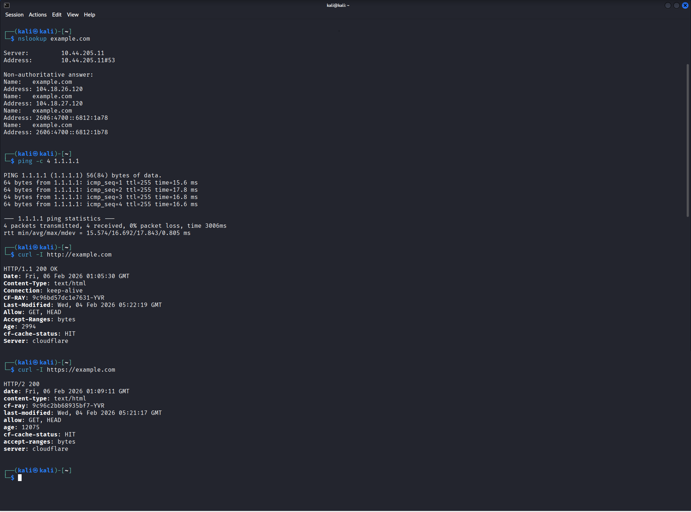
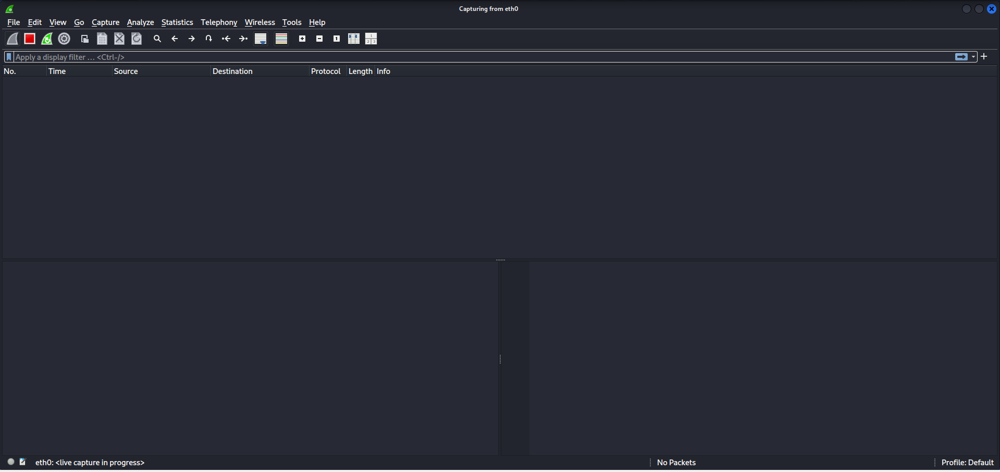

# Wireshark Packet Capture — Mini Lab (DNS + ICMP + HTTP/HTTPS)

## Objective
Capture and analyze **DNS**, **ICMP**, and **HTTP/HTTPS** traffic in Wireshark, then summarize key takeaways for repeatable triage (DNS → resolved IP → conversations).

## Environment
- Interface: `eth0`
- Artifact: `wireshark_mvp_capture.pcapng`

## Method
1. Start a live capture on `eth0` in Wireshark.
2. Generate traffic from the terminal:
   - `nslookup example.com`
   - `ping -c 4 1.1.1.1`
   - `curl -I http://example.com`
   - `curl -I https://example.com`

> Ssetup proof: Capture started on `eth0`
>
> 

## Filters Used
- `dns`
- `icmp`
- `http`
- `tls`

## Findings

### 1) DNS resolution for example.com
DNS queries for `example.com` returned:
- **A records:** `104.18.26.120`, `104.18.27.120`
- **AAAA records:** `2606:4700::6812:1a78`, `2606:4700::6812:1b78`

### 2) HTTP activity (port 80)
HTTP traffic showed a request to `http://example.com/` followed by a successful response:
- **Status:** `HTTP/1.1 200 OK`

### 3) Conversation-level summary
Using **Statistics → Conversations**, the capture shows outbound connections from the host to remote endpoints over:
- **HTTP (80/tcp)**
- **HTTPS (443/tcp)**

## Key Takeaways
- DNS is a strong pivot point: domain → resolved IP(s) → follow conversations.
- A simple workflow for triage:
  1) Filter `dns` to identify lookups  
  2) Extract resolved IPs  
  3) Filter `http` / `tls` and validate destinations  
  4) Use **Conversations** to see who talked to whom, on what ports, and how much data moved

## Next
- Add an **ICMP-specific screenshot** (`icmp` filter showing Echo request/reply) to round out the evidence set.
- Reuse this workflow for suspicious traffic triage: **rare DNS → unexpected outbound HTTP/TLS → follow conversation → inspect stream**.

## Observed Indicators
See: [iocs/iocs.md](iocs/iocs.md)