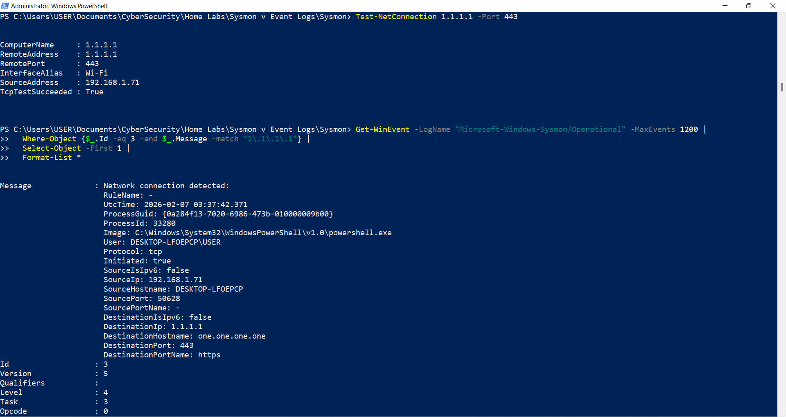
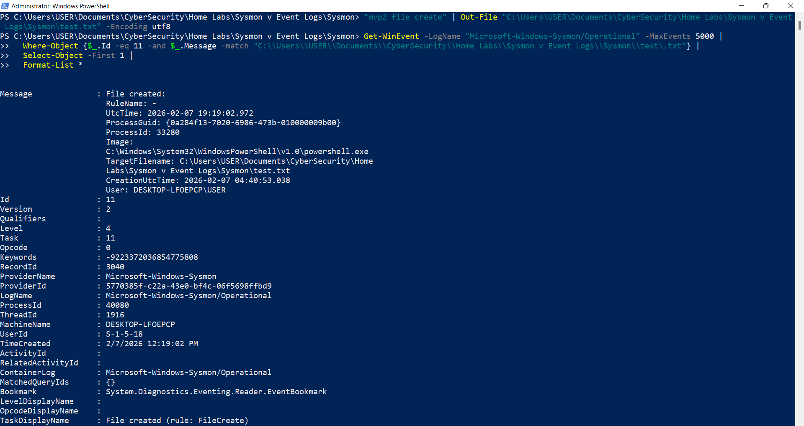

# Sysmon vs Windows Event Logs — Validation Lab (Process, Network, File, Registry, PowerShell)

## Objective
Validate that the **same endpoint activity** is recorded across:
- **Sysmon** (Microsoft-Windows-Sysmon/Operational)
- **Windows Security log** (native auditing)
- **PowerShell Operational log** (script block logging)

## Data Sources
- Sysmon Operational: Event IDs **1, 3, 11, 13**
- Security log: Event IDs **4688, 4657**
- PowerShell Operational: Event ID **4104**

## Method
I generated several endpoint actions, then confirmed they appeared in the corresponding logs using Event Viewer and PowerShell (`Get-WinEvent`).

Actions tested:
- Process creation (Notepad)
- Child process + command line (cmd → `ipconfig /all`)
- Network connection (PowerShell → 1.1.1.1:443)
- File creation (`test.txt`)
- Registry create/set/modify (`HKCU:\Software\MVP2Key\MVP2_RegTest`)
- PowerShell ScriptBlock logging (4104)

---

## Findings

### 1) Process Creation — Notepad
**Sysmon EID 1** captured rich process creation details (image path, command line, parent process, hashes).

**Security EID 4688** recorded the corresponding native audit event (“A new process has been created.”) with process details.

---

### 2) Child Process + Command Line — cmd → `ipconfig /all`
**Sysmon EID 1** captured `ipconfig.exe` including the command line and parent (`cmd.exe`).

**Security EID 4688** recorded the same process creation with the command line.

---

### 3) Network Connection — PowerShell → 1.1.1.1:443
A connectivity test was generated, then validated in Sysmon.

**Sysmon EID 3** captured:
- Process: `powershell.exe`
- Destination: `1.1.1.1`
- Port: `443/tcp`
- Destination hostname: `one.one.one.one`

---

### 4) File Creation — `test.txt`
**Sysmon EID 11** captured the creation of `test.txt` with the creating process (`powershell.exe`) and the target file path.

---

### 5) Registry Creation / Modification — `HKCU:\Software\MVP2Key\MVP2_RegTest`
**Sysmon EID 13** captured a registry value set event for `MVP2_RegTest`.

**Security EID 4657** recorded the corresponding registry value modification, including **old vs new** value.

---

### 6) PowerShell Script Visibility — Script Block Logging
**PowerShell Operational EID 4104** captured ScriptBlockText (visibility into what PowerShell executed).

---

## Key Takeaway
- **Sysmon** provides richer investigative detail (process lineage, command line, network metadata, and more).
- **Security** logs provide native audit proof (4688 for process creation, 4657 for registry changes).
- **PowerShell 4104** adds crucial context: **what PowerShell actually executed**.

## Detection Ideas (practical)
- Correlate **Sysmon EID 1** with **Security 4688** to validate process creation coverage.
- Alert on PowerShell making outbound connections (**Sysmon EID 3**) to unexpected external IPs/ports.
- Monitor “new file created by PowerShell” patterns (**Sysmon EID 11**) in sensitive directories.
- Watch for suspicious persistence-like registry writes (**Sysmon EID 13** + **Security 4657**) under common run keys / unusual HKCU paths.

## Observed Indicators / Artifacts
See: [iocs/iocs.md](iocs/iocs.md)