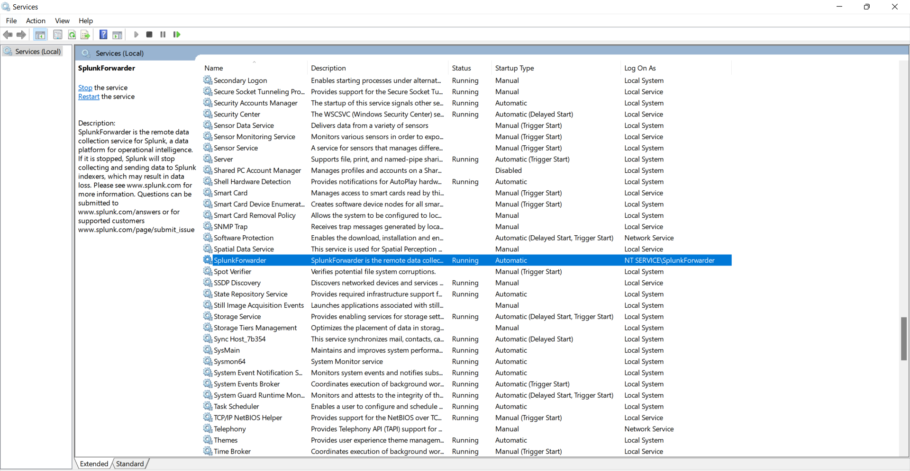
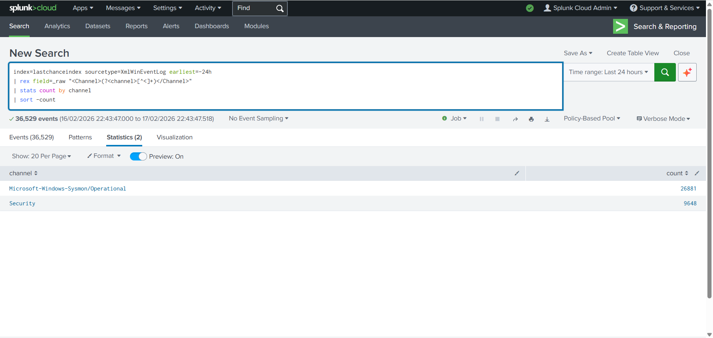

# Splunk Cloud — Forward Windows Security + Sysmon Logs via Universal Forwarder

## Objective
Validate that a Windows endpoint can forward **Security** and **Sysmon** event logs to **Splunk Cloud** using the **Splunk Universal Forwarder (UF)**, and confirm the events are searchable in Splunk.

## Method (What I configured)
1) **Splunk Cloud**
- Installed and enabled **Splunk Add-on for Microsoft Windows (TA-Windows)**.

2) **Windows endpoint**
- Installed **Splunk Universal Forwarder** and confirmed the **SplunkForwarder** service is running.

- Installed Splunk Cloud UF credentials package (`splunkclouduf.spl`) and restarted UF.

- Configured UF `inputs.conf` to collect:
  - `WinEventLog://Security`
  - `WinEventLog://Microsoft-Windows-Sysmon/Operational`

## Test Activity Generated
To produce confirmable telemetry, I generated:
- Process creation: **Notepad**
- Command execution: **ipconfig /all**
- Network test: **Test-NetConnection 1.1.1.1 -Port 443** (to produce Sysmon network events)

## Findings (Evidence in Splunk Cloud)

### 1) Ingestion working (channels present)
Events arrived in Splunk Cloud and were searchable in the **lastchanceindex** index. A channel breakdown confirmed both sources are present:
- `Security`
- `Microsoft-Windows-Sysmon/Operational`

### 2) Security log evidence — EventCode 4688 (process creation)
Security **EventCode=4688** (process creation) was returned in Splunk for recent activity.

### 3) Sysmon evidence — EventCode 3 (network connection)
Sysmon events were searchable under:
- `Channel="Microsoft-Windows-Sysmon/Operational"`

Filtering to **EventCode=3** returned network connection telemetry generated during testing (e.g., outbound to `1.1.1.1:443`).

## Notes / Observations
- Events were routed into `lastchanceindex` (Splunk “last chance” index) due to index routing/availability settings in this environment, so searches were run against `index=lastchanceindex`.

## Key Takeaway
The Universal Forwarder successfully forwarded **Windows Security** and **Sysmon** logs into **Splunk Cloud**, and Splunk searches confirmed both:
- **Process creation** telemetry (Security 4688)
- **Network connection** telemetry (Sysmon EventCode 3)

This validates end-to-end collection: **endpoint → UF → Splunk Cloud** for investigation-ready Windows telemetry.

## Observed Indicators / Artifacts
See: [iocs/iocs.md](iocs/iocs.md)