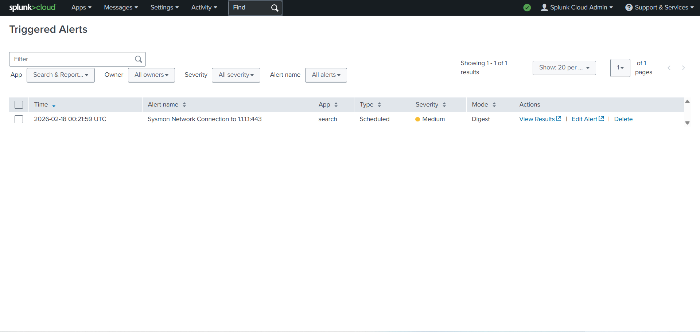

# Splunk Cloud — Detection & Alert (Sysmon Network Connection to 1.1.1.1:443)

## Objective
Create a Splunk detection and alert that triggers on observable endpoint network activity.

## Detection Logic
Trigger when **Sysmon Event ID 3** records an outbound connection to:
- Destination IP: `1.1.1.1`
- Destination port: `443`

## Method
1. Run a Splunk search to return Sysmon network connection events matching `DestinationIp=1.1.1.1` and `DestinationPort=443`.
2. Save the search as a **scheduled alert** (cron cadence).
3. Set trigger condition to **Number of results > 0**.
4. Generate endpoint telemetry using:
   - `Test-NetConnection 1.1.1.1 -Port 443`

## Evidence

### 1) Detection search (SPL)

### 2) Alert configuration/details

### 3) Telemetry generation (endpoint)

### 4) Alert fired (Triggered Alerts)

## Result
The alert successfully triggered and appeared under **Triggered Alerts**, confirming end-to-end detection and alerting.

## Observables / Artifacts
- Sysmon: `EventCode=3` (Network connection)
- Destination: `1.1.1.1:443`
- Typical data fields used: `Channel`, `EventCode`, `DestinationIp`, `DestinationPort`