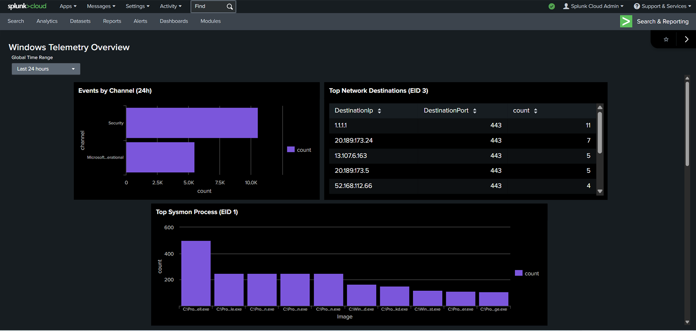

# Splunk Cloud Dashboard — Windows Telemetry Overview

## Objective
Build a simple Splunk Cloud dashboard to summarize Windows endpoint telemetry (Sysmon + Security logs) for quick triage and visibility.

## Data Sources
- `index=lastchanceindex`
- `sourcetype=XmlWinEventLog`
- Channels:
  - `Microsoft-Windows-Sysmon/Operational`
  - `Security`

## Dashboard Built
**Windows Telemetry Overview** (Dashboard Studio, Grid layout)

## Evidence




## Panels Implemented (Last 24h)

### 1) Event Volume by Channel
Counts events by log channel to compare Security vs Sysmon volume.

**SPL**
```spl
index=lastchanceindex sourcetype=XmlWinEventLog earliest=-24h
| rex field=_raw "<Channel>(?<channel>[^<]+)</Channel>"
| eval channel=coalesce(Channel, channel)
| stats count by channel
| sort -count

### 2) Top Sysmon Process Images (EID 1)
Top process image paths observed from Sysmon Process Create.

**SPL**
```spl
index=lastchanceindex sourcetype=XmlWinEventLog Channel="Microsoft-Windows-Sysmon/Operational" EventCode=1 earliest=-24h
| stats count by Image
| sort -count
| head 10

### 3) Top Sysmon Network Destinations (EID 3)
Top destination IP/port pairs from Sysmon Network Connection events.

**SPL**
```spl
index=lastchanceindex sourcetype=XmlWinEventLog Channel="Microsoft-Windows-Sysmon/Operational" EventCode=3 earliest=-24h
| stats count by DestinationIp DestinationPort
| sort -count
| head 10

### 4) Security 4688 Volume (Hourly)
Hourly trend of process creations.

**SPL**
```spl
index=lastchanceindex sourcetype=XmlWinEventLog Channel=Security EventCode=4688 earliest=-24h
| timechart span=1h count


## Result
Dashboard panels successfully populated and presented key Windows telemetry at a glance, demonstrating end-to-end ingestion, SPL searches, and visualization in Splunk Cloud.

## Observables / Artifacts
- Data routed to: `index=lastchanceindex`
- Log channels: `Security`, `Microsoft-Windows-Sysmon/Operational`
- Sysmon EventCodes used: `1` (Process Create), `3` (Network Connect)
- Security EventCode used: `4688` (Process Creation)