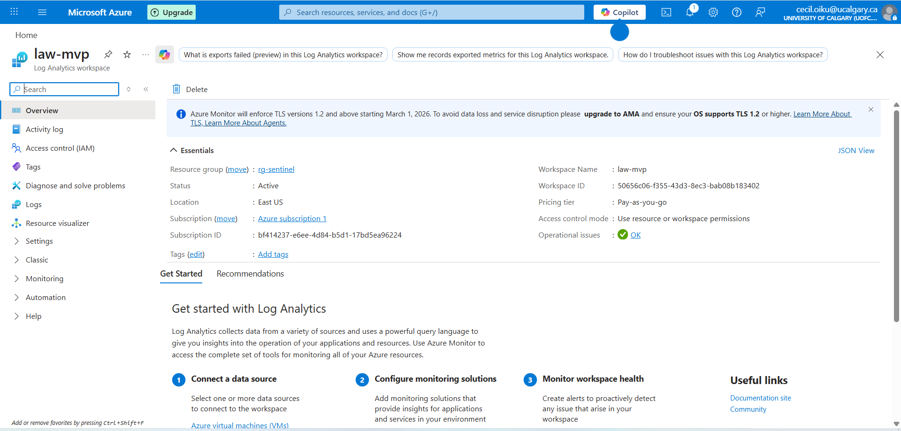
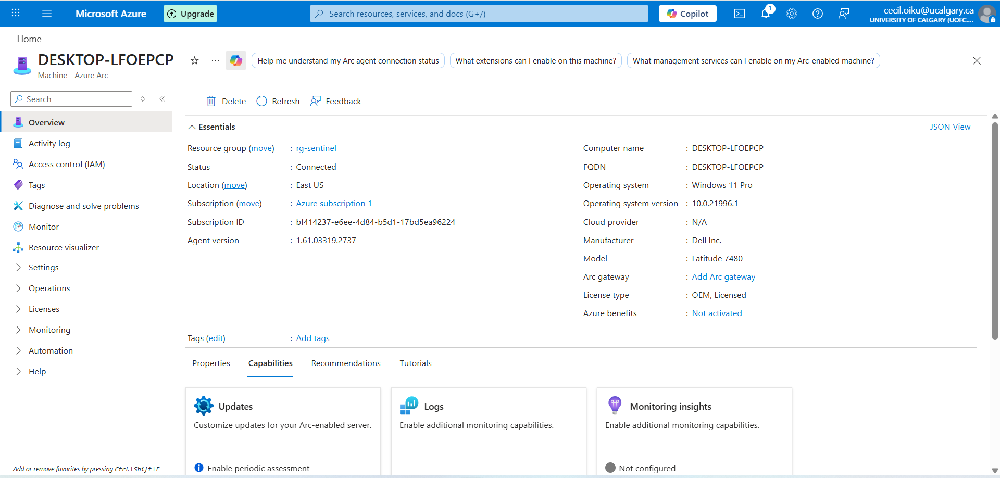
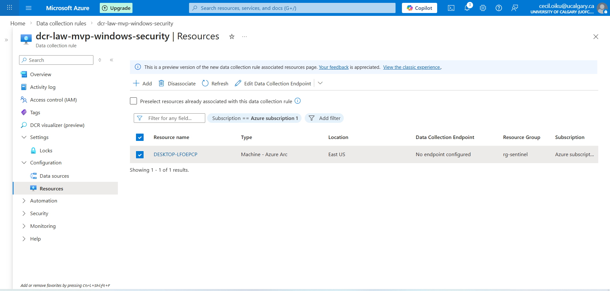

# MVP7 — Microsoft Sentinel + KQL Analytics Rules (SecurityEvent)

## Objective
Deploy Microsoft Sentinel on a Log Analytics workspace, ingest Windows Security Events via AMA, and create two scheduled analytics rules using KQL:
1) Brute Force / Password Spray (4625 spike)
2) Suspicious PowerShell Indicators (4688 + command line patterns)

## Environment
- Log Analytics workspace: `law-mvp`
- Microsoft Sentinel: enabled on the workspace
- Endpoint onboarding: Azure Arc + Azure Monitor Agent (AMA)
- Data source: Windows Security Events via AMA (`SecurityEvent` table)

## Evidence (Setup + Ingestion)








---

## Detection 1 — Brute Force / Password Spray (Event ID 4625 spike)

### KQL
```kql
SecurityEvent
| where EventID == 4625
| summarize FailedLogons=count(), DistinctUsers=dcount(TargetUserName) by IpAddress, bin(TimeGenerated, 15m)
| where FailedLogons >= 5
| sort by FailedLogons desc

## Detection 2 — Suspicious PowerShell Indicators (Event ID 4688)

### KQL
```kql
SecurityEvent
| where EventID == 4688
| where NewProcessName has_any ("powershell.exe","pwsh.exe")
| where CommandLine has_any ("-enc","EncodedCommand","IEX","Invoke-WebRequest","DownloadString","FromBase64String")
| project TimeGenerated, Computer, Account, NewProcessName, CommandLine, ParentProcessName
| sort by TimeGenerated desc

## Results
- Confirmed Windows Security events are ingesting into Log Analytics (`SecurityEvent` table).
- Created and enabled two scheduled analytics rules in Microsoft Sentinel:
  - `MVP - Brute Force / Password Spray (4625 spike)`
  - `MVP - Suspicious PowerShell Indicators`

## Observables / Artifacts
- Workspace: `law-mvp`
- Data source: **Windows Security Events via AMA**
- Table: `SecurityEvent`
- Event IDs used:
  - `4625` (failed logon)
  - `4688` (process creation)
- Analytics rules created (Scheduled):
  - 4625 spike rule (threshold: `FailedLogons >= 5` per `15m`, trigger when results > 0)
  - PowerShell indicators rule (4688 + suspicious command-line keywords, trigger when results > 0)