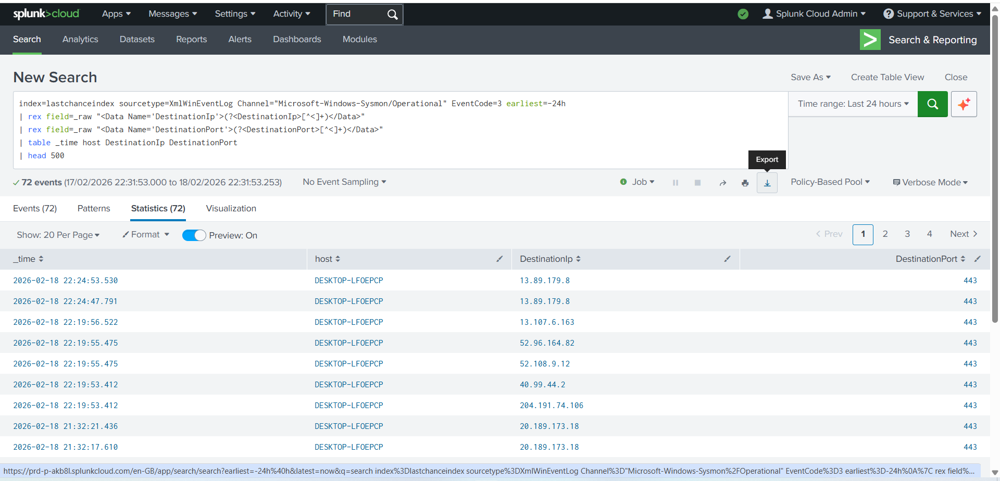
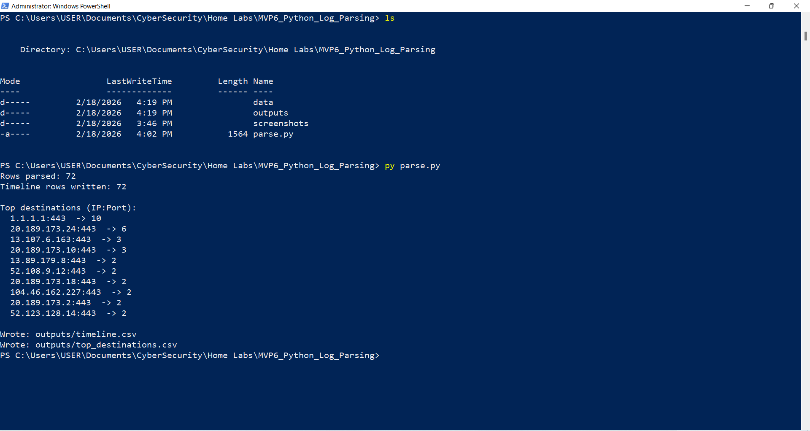
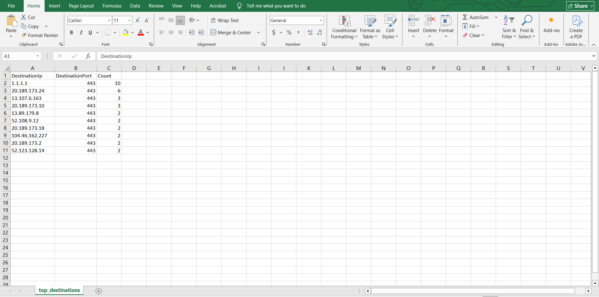

# Python Log Parsing — Splunk Export (Sysmon Event ID 3)

## Objective
Demonstrate basic log parsing and summarization of Windows telemetry exported from Splunk using Python.

## Dataset
Splunk-exported CSV of **Sysmon Event ID 3 (network connections)** from:
- `index=lastchanceindex`
- `sourcetype=XmlWinEventLog`
- `Channel="Microsoft-Windows-Sysmon/Operational"`
- Time window: **Last 24 hours**
- Total events exported: **72**

## Method

### 1) Export telemetry from Splunk
A Splunk search was used to extract `DestinationIp` and `DestinationPort` (via regex) and export these fields to CSV:

- Fields exported: `_time`, `host`, `DestinationIp`, `DestinationPort`

### 2) Parse and summarize with Python
A Python script (`parse.py`) was run locally to:
1. Write a clean **timeline CSV** (`timeline.csv`)
2. Compute **top destination IP:port counts** (`top_destinations.csv`)

### 3) Validate outputs
Timeline output:

Top destinations output:

## Result
The script successfully parsed **all 72 events**, produced:
- `outputs/timeline.csv`
- `outputs/top_destinations.csv`

…and printed a ranked list of top destination IP:port pairs (e.g., `1.1.1.1:443`).

## Observables / Artifacts
- Data source: Splunk export of Sysmon **EventCode=3**
- Output files:
  - `timeline.csv` (normalized event timeline)
  - `top_destinations.csv` (destination frequency summary)
- Common columns used: `_time`, `host`, `DestinationIp`, `DestinationPort`
